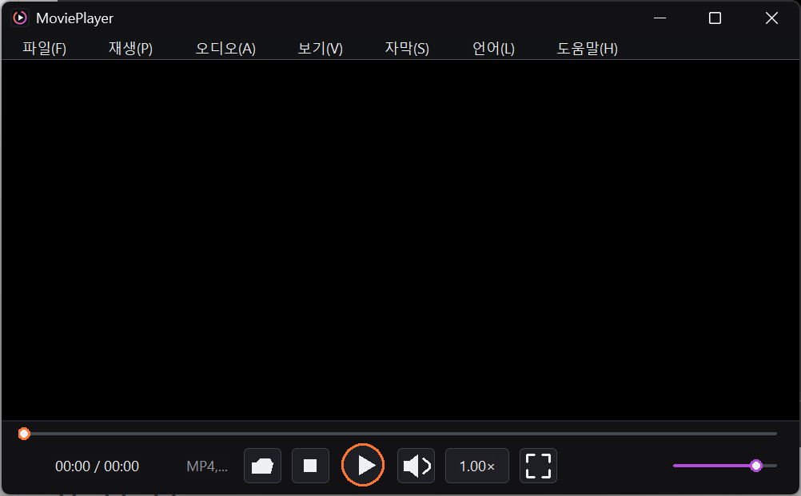
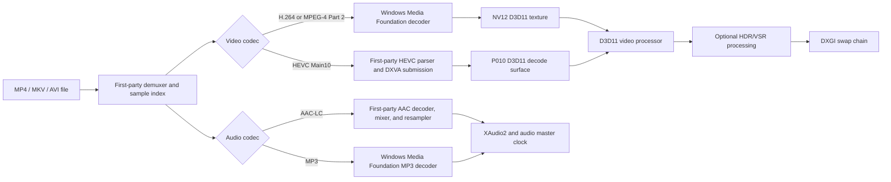
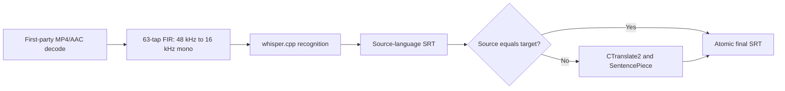

# MoviePlayer 0.2 Technical Guide

MoviePlayer is a native Windows x64 video player written in C++17. It combines
a first-party media layer with selected Windows platform decoders, D3D11/DXVA
video acceleration, XAudio2 output, and an optional local AI subtitle worker.
Media playback and subtitle generation do not send video, audio, or generated
text to an online inference service.



## Implementation boundaries

The implementation is deliberately split into three clearly defined areas:

| Area | Responsibility |
|---|---|
| First-party MoviePlayer code | MP4/MKV/AVI parsing, sample indexing and seeking, codec-neutral interfaces, HEVC syntax parsing and DXVA submission, AAC-LC decoding, channel mixing, resampling, subtitle parsing, playback scheduling, and the Win32 UI |
| Windows platform components | H.264, MPEG-4 Part 2, and MP3 decode transforms; D3D11 devices, DXVA decode services, video processing, DXGI presentation, XAudio2 output, and WARP rendering fallback |
| Optional components | NVIDIA RTX Video VSR, whisper.cpp speech recognition, CTranslate2 translation, and SentencePiece tokenization |

Calling a component "first-party" means that its source was implemented in this
repository. It does not imply that MoviePlayer implements the Windows APIs,
GPU driver, optional SDK, or AI libraries that it calls.

## Supported playback scope

| Area | Current scope |
|---|---|
| Operating system | Windows 10 or 11 x64, per-monitor V2 DPI, Unicode, and long-path-aware file handling |
| Containers | Non-fragmented MP4, focused Matroska/MKV, and classic indexed RIFF AVI |
| Video | H.264, HEVC Main10 4:2:0 for the supported DXVA path, and Xvid/DX50 MPEG-4 Part 2 |
| Audio | AAC-LC at 24, 44.1, or 48 kHz; stereo, 5.1, and PCE 7.1 downmix paths; MP3 in AVI; XAudio2 output |
| Seeking | MP4 sync samples, MKV cues, and AVI keyframe indexes, with decoder and audio-clock reset |
| Subtitles | External SRT, ASS/SSA, and SMI/SAMI; embedded Matroska UTF-8/ASS/SSA text and DVD VobSub (S_VOBSUB) bitmap subtitles; optional local transcription and translation |
| Rendering | D3D11 video processing, aspect-ratio-preserving presentation, subtitle composition, HDR color handling, and optional RTX Video VSR |
| UI languages | English, Japanese, Korean, French, Simplified Chinese, Traditional Chinese, Spanish, Portuguese, Hindi, Indonesian, and Arabic |

These are focused playback implementations for ordinary consumer files, not
complete implementations of every profile, level, chroma format, bit depth,
container variation, or optional feature in the relevant standards. Unsupported
or unusual files can fail to open or decode.

## Playback architecture



The demux, video-decode, and audio-decode stages run on separate worker threads
with bounded queues. Audio is the playback master clock. Seeking flushes queued
packets and frames, resets the decoders and audio clock, and resumes from the
container-specific sync point.

## First-party media implementation

MoviePlayer directly implements the following media functions:

- The `IMediaDemuxer` abstraction and MP4, MKV, and AVI readers.
- MP4 sample tables, 32/64-bit chunk offsets, decode/composition timing,
  synchronization samples, and the codec configuration records used by the
  supported H.264, HEVC, and AAC paths.
- Matroska EBML elements, clusters, cues, block groups, and fixed, Xiph, and
  EBML lacing for the supported tracks.
- AVI RIFF chunk parsing and `idx1` keyframe indexing.
- A codec-neutral packet, track, decoded-frame, and decoder interface shared by
  the playback engine and smoke tests.
- HEVC parameter-set and slice parsing, decoded-picture tracking, and creation
  of the DXVA picture-parameter, quantization-matrix, slice-control, and
  bitstream buffers submitted to the GPU.
- AAC-LC spectral Huffman decoding, inverse quantization, stereo tools, TNS,
  IMDCT/window overlap, native channel mixing, and PCM generation.
- External and embedded text subtitle decoding, subtitle timing, and subtitle
  composition after video processing.
- The subtitle worker's built-in MP4/AAC extraction path and 63-tap FIR
  conversion from 48 kHz audio to 16 kHz mono PCM.

## Windows Media Foundation integration

Windows Media Foundation is used only for selected codec backends:

- H.264 input is passed to the Windows H.264 Media Foundation Transform. The
  decoder is configured for NV12 output and is asked to use video acceleration.
  The Microsoft transform can fall back to software decoding when the installed
  decoder or GPU cannot accelerate a stream.
- Xvid/DX50 MPEG-4 Part 2 input uses an installed Windows Media Foundation
  decoder selected for MP4V input and NV12 output.
- MP3 audio uses the Windows MP3 transform and produces PCM for MoviePlayer's
  audio pipeline.

Media Foundation does not parse the MP4, MKV, or AVI container, perform seeking,
decode AAC, parse HEVC syntax, schedule playback, render subtitles, or manage
the application UI.

## Hardware acceleration and rendering

MoviePlayer first creates a hardware D3D11 device with video support. The same
device is shared by the video decoder and renderer so decoded NV12 or P010
surfaces can remain on the GPU through the video-processing path.

### H.264

The Windows H.264 transform receives an acceleration preference. When the
Windows decoder and display driver accept the stream, decoding is accelerated;
otherwise the transform can produce software-decoded NV12 frames that are
uploaded to textures owned by MoviePlayer's D3D11 device.

### HEVC Main10

MoviePlayer parses the HEVC bitstream itself but delegates pixel reconstruction
to the GPU. This path requires the D3D11 HEVC Main10 decoder profile, P010
output support, and a usable unencrypted DXVA VLD configuration. There is no
software HEVC fallback in the current implementation, so opening the stream
fails with a diagnostic when any of those requirements is missing.

### Presentation, HDR, and upscaling

The D3D11 video processor converts decoder surfaces to the swap-chain format,
applies source/destination rectangles, preserves aspect ratio, and handles the
available color-space metadata. HDR PQ content uses the dedicated intermediate
and tone-mapping path where required. Subtitles are blended after video
processing so scaling does not blur the text.

NVIDIA RTX Video VSR is optional. Initialization or per-frame VSR failure does
not stop playback; MoviePlayer automatically returns to ordinary D3D11 scaling.
If a hardware D3D11 device cannot be created, the renderer attempts a WARP
software device for basic rendering. WARP normally lacks video decode and video
processor interfaces, so hardware-dependent streams can remain unavailable.

## Acceleration and fallback summary

| Path | Preferred path | Fallback |
|---|---|---|
| H.264 decode | Windows transform with DXVA acceleration | Windows transform software decode, then D3D11 texture upload |
| MPEG-4 Part 2 decode | Installed Windows transform | No separate MoviePlayer decoder |
| HEVC Main10 decode | First-party parsing plus D3D11/DXVA P010 decode | No software fallback |
| Video presentation | Hardware D3D11 video processor | Basic WARP rendering where the required interfaces are available |
| RTX Video VSR | NVIDIA runtime on a compatible RTX GPU and driver | Standard D3D11 scaling |
| AAC-LC decode | First-party decoder | No alternate decoder |
| MP3 decode | Windows MP3 transform | No alternate decoder |

## Local AI subtitles

The **Generate AI Subtitles...** command uses the current UI language as the
target language and detects the speech language automatically.



The current worker input path requires an MP4 file with a supported 48 kHz AAC
track. It stores the source transcript beside the video, translates only when
needed, writes output through a temporary `.part` file, and atomically replaces
the final SRT. Model files are not included in the binary package.

Install the pinned models with:

```powershell
.\install_ai_models.cmd
```

The default setup uses `ggml-large-v3-turbo.bin` for recognition and an int8
M2M100 418M model for translation. A separately licensed Japanese-to-Korean
CTranslate2 model can be installed with:

```powershell
.\install_japanese_translation_model.cmd
```

Read `licenses\AI-RUNTIME-AND-MODELS.md` before installing or redistributing
models. Model publishers' licenses, model cards, base-model terms, and training
data conditions remain applicable.

## Build from a clean clone

Requirements:

- Windows 10 or 11 x64
- Visual Studio 2019 16.11 with **Desktop development with C++** and the v142
  x64 toolset
- The CMake bundled with Visual Studio
- PowerShell 5.1 or later, `curl.exe`, and `git.exe`
- NVIDIA RTX Video SDK files when VSR is built
- Pinned native AI source dependencies when the subtitle worker is built

```powershell
git clone https://github.com/tklee000/movieplayer.git
cd movieplayer
powershell -NoProfile -ExecutionPolicy Bypass -File .\scripts\setup_rtx_video_sdk.ps1
powershell -NoProfile -ExecutionPolicy Bypass -File .\scripts\setup_native_ai_dependencies.ps1
.\build.cmd
```

Important Release outputs include:

```text
build-vs2019/Release/
  MoviePlayer.exe
  MoviePlayerSubtitleWorker.exe
  ctranslate2.dll
  nvngx_vsr.dll
  VC142 runtime DLLs
```

Run the codec smoke test explicitly with:

```powershell
cmake --build build-vs2019 --config Release --target MovieCodecSmoke
.\build-vs2019\Release\MovieCodecSmoke.exe "D:\path\video.mp4"
```

Create the distributable folder with:

```powershell
.\create_deploy.cmd
```

## Privacy, licenses, and temporary data

- Ordinary playback does not require a network connection.
- Model installers download pinned files and verify their size and SHA-256.
- Speech recognition and translation run in a local process after setup.
- AI status and logs are stored under `third_party\whisper\runtime`; temporary
  work files are cleaned when the job ends.
- MoviePlayer's first-party source is licensed under the MIT License. Windows,
  NVIDIA, AI libraries, and models retain their respective terms.

See `THIRD_PARTY_NOTICES.md`, the `licenses` directory, and
`third_party/whisper/LICENSES.md` for the applicable versions, notices, and
redistribution material. Those files are technical compliance material, not
legal advice.
