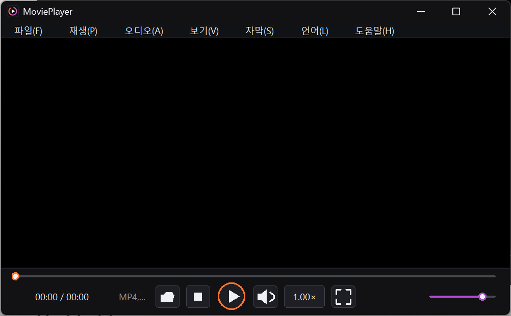
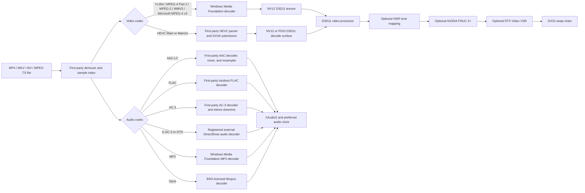
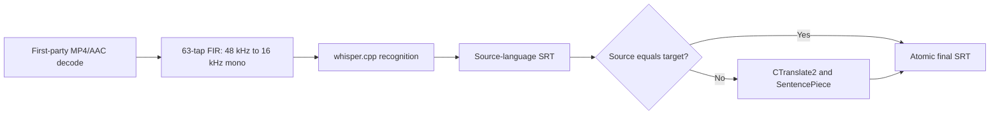

# MoviePlayer 0.5 Technical Guide

MoviePlayer is a native Windows x64 video player written in C++17. It combines
a first-party media layer with selected Windows platform decoders, D3D11/DXVA
video acceleration, XAudio2 output, and an optional local AI subtitle worker.
Media playback and subtitle generation do not send video, audio, or generated
text to an online inference service.



## Implementation boundaries

The implementation is deliberately split into three clearly defined areas:

| Area | Responsibility |
|---|---|
| First-party MoviePlayer code | MP4/MKV/AVI/MPEG-TS parsing, sample indexing and seeking, codec-neutral interfaces, HEVC syntax parsing and DXVA submission, AAC-LC, FLAC, and AC-3 decoding, channel mixing, resampling, subtitle parsing, playback scheduling, and the Win32 UI |
| libopus | Matroska mono/stereo Opus decoding to 48 kHz float PCM |
| Windows platform components | H.264, MPEG-4 Part 2, MPEG-2, WMV3, Microsoft MPEG-4 v3, and MP3 decode transforms; D3D11 devices, DXVA decode services, video processing, DXGI presentation, XAudio2 output, and WARP rendering fallback |
| External DirectShow audio decoder | Compatible registered decoder used for E-AC-3 and DTS decode; its binaries remain external |
| Optional components | NVIDIA RTX Video VSR, whisper.cpp speech recognition, CTranslate2 translation, and SentencePiece tokenization |

Calling a component "first-party" means that its source was implemented in this
repository. It does not imply that MoviePlayer implements the Windows APIs,
GPU driver, optional SDK, or AI libraries that it calls.

## Supported playback scope

| Area | Current scope |
|---|---|
| Operating system | Windows 10 or 11 x64, per-monitor V2 DPI, Unicode, and long-path-aware file handling |
| Containers | Non-fragmented MP4, focused Matroska/MKV, RIFF AVI with `idx1` or `movi` scan recovery, and 188/192/204-byte MPEG-TS; signature-first detection with extension fallback |
| Video | H.264, HEVC Main/Main10 4:2:0 for the supported DXVA paths, MPEG-4 Part 2, MPEG-2, WMV3, and Microsoft MPEG-4 v3 for the supported container paths |
| Audio | AAC-LC at 24, 44.1, or 48 kHz; MPEG-TS AAC/ADTS; native FLAC in MKV at 4 through 32 bits and up to eight channels; native AC-3 in MP4/MKV/AVI/MPEG-TS with mono through 5.1 input; external DirectShow E-AC-3/DTS decode; stereo output/downmix; mono/stereo Opus in MKV; MP3 in AVI; XAudio2 output |
| Seeking | MP4 sync samples, MKV cues, AVI keyframe/index-or-scan samples, and approximate MPEG-TS byte seeking followed by the next keyframe, with decoder and playback-clock reset |
| Subtitles | External SRT, WebVTT, ASS/SSA, and SMI/SAMI; embedded Matroska UTF-8/ASS/SSA text and DVD VobSub (S_VOBSUB) bitmap subtitles; optional local transcription and translation |
| Rendering | D3D11 video processing, optional NVIDIA 2× FRUC followed by RTX Video VSR, aspect-ratio-preserving presentation, subtitle composition, and HDR color handling |
| UI languages | English, Japanese, Korean, French, German, Simplified Chinese, Traditional Chinese, Spanish, Portuguese, Hindi, Indonesian, and Arabic |

Supported Matroska or MPEG-TS E-AC-3 and DTS tracks use a compatible external
DirectShow audio decoder registered on the system. MoviePlayer discovers a
decoder by media type and converts its supported PCM output to stereo. It does
not install, bundle, or prescribe a particular external codec.

These are focused playback implementations for ordinary consumer files, not
complete implementations of every profile, level, chroma format, bit depth,
container variation, or optional feature in the relevant standards. Unsupported
or unusual files can fail to open or decode.

## Playback architecture


```mermaid
flowchart LR
    A["MP4 / MKV / AVI / MPEG-TS file"] --> B["First-party demuxer and sample index"]
    B --> C{"Video codec"}
    C -->|"H.264 / MPEG-4 Part 2 / MPEG-2 / WMV3 / Microsoft MPEG-4 v3"| D["Windows Media Foundation decoder"]
    C -->|"HEVC Main or Main10"| E["First-party HEVC parser and DXVA submission"]
    D --> F["NV12 D3D11 texture"]
    E --> G["NV12 or P010 D3D11 decode surface"]
    F --> H["D3D11 video processor"]
    G --> H
    H --> I["Optional HDR tone mapping"]
    I --> S["Optional NVIDIA FRUC 2×"]
    S --> T["Optional RTX Video VSR"]
    T --> J["DXGI swap chain"]
    B --> K{"Audio codec"}
    K -->|"AAC-LC"| L["First-party AAC decoder, mixer, and resampler"]
    K -->|"FLAC"| Q["First-party lossless FLAC decoder"]
    K -->|"AC-3"| P["First-party AC-3 decoder and stereo downmix"]
    K -->|"E-AC-3 or DTS"| R["Registered external DirectShow audio decoder"]
    K -->|"MP3"| M["Windows Media Foundation MP3 decoder"]
    K -->|"Opus"| O["BSD-licensed libopus decoder"]
    L --> N["XAudio2 and preferred audio clock"]
    Q --> N
    P --> N
    R --> N
    M --> N
    O --> N
```

The demux, video-decode, and audio-decode stages run on separate worker threads
with bounded queues. Healthy audio output is the preferred playback master
clock. Playback uses the external clock when audio is absent or after sustained
audio decode/output failure. Seeking flushes queued packets and frames, resets
the decoders and clocks, and resumes from the container-specific sync point.

## First-party media implementation

MoviePlayer directly implements the following media functions:

- The `IMediaDemuxer` abstraction and MP4, MKV, AVI, and MPEG-TS readers.
- MP4 sample tables, 32/64-bit chunk offsets, decode/composition timing,
  synchronization samples, and the codec configuration records used by the
  supported H.264, HEVC, MPEG-4 Part 2, MPEG-2, AAC, and AC-3 paths.
- Matroska EBML elements, clusters, cues, block groups, and fixed, Xiph, and
  EBML lacing for the supported tracks.
- AVI RIFF chunk parsing, `idx1` keyframe indexing, and bounded `movi` scanning
  for files without a usable classic index.
- MPEG-TS packet-layout detection, PAT/PMT discovery, PES assembly, PTS
  normalization, stream probing, and keyframe-aware reading.
- A codec-neutral packet, track, decoded-frame, and decoder interface shared by
  the playback engine and smoke tests.
- HEVC parameter-set and slice parsing, decoded-picture tracking, and creation
  of the DXVA picture-parameter, quantization-matrix, slice-control, and
  bitstream buffers submitted to the GPU.
- AAC-LC spectral Huffman decoding, inverse quantization, stereo tools, TNS,
  IMDCT/window overlap, native channel mixing, and PCM generation.
- Matroska `A_OPUS` track extraction and `OpusHead` validation before packets
  are passed to the separately licensed libopus decoder.
- External and embedded text subtitle decoding, subtitle timing, and subtitle
  composition after video processing.
- The subtitle worker's built-in MP4/AAC extraction path and 63-tap FIR
  conversion from 48 kHz audio to 16 kHz mono PCM.

## Windows Media Foundation integration

Windows Media Foundation is used only for selected codec backends:

- H.264 input is passed to the Windows H.264 Media Foundation Transform. The
  decoder is configured for NV12 output and is asked to use video acceleration.
  The Microsoft transform can fall back to software decoding when the installed
  decoder or GPU cannot accelerate a stream.
- MPEG-4 Part 2, MPEG-2, WMV3, and Microsoft MPEG-4 v3 input uses the matching
  Windows decoder for the supported MP4, AVI, and MPEG-TS paths. NV12 output is
  preferred; supported YUY2 output is converted to NV12 before presentation.
- MP3 audio uses the Windows MP3 transform and produces PCM for MoviePlayer's
  audio pipeline.

Media Foundation does not parse the MP4, MKV, AVI, or MPEG-TS container,
perform seeking, decode AAC or Opus, parse HEVC syntax, schedule playback,
render subtitles, or manage the application UI.

## Hardware acceleration and rendering

MoviePlayer first creates a hardware D3D11 device with video support. The same
device is shared by the video decoder and renderer so decoded NV12 or P010
surfaces can remain on the GPU through the video-processing path.

### H.264

The Windows H.264 transform receives an acceleration preference. When the
Windows decoder and display driver accept the stream, decoding is accelerated;
otherwise the transform can produce software-decoded NV12 frames that are
uploaded to textures owned by MoviePlayer's D3D11 device.

### HEVC Main and Main10

MoviePlayer parses the HEVC bitstream itself but delegates pixel reconstruction
to the GPU. The 8-bit Main path requires the D3D11 HEVC Main decoder profile
with NV12 output; the 10-bit Main10 path requires the Main10 profile with P010
output. Both require a usable unencrypted DXVA VLD configuration. There is no
software HEVC fallback in the current implementation, so opening the stream
fails with a diagnostic when any of those requirements is missing.

### Presentation, frame interpolation, HDR, and upscaling

The D3D11 video processor converts decoder surfaces to the swap-chain format,
applies source/destination rectangles, preserves aspect ratio, and handles the
available color-space metadata. HDR PQ content uses the dedicated intermediate
and tone-mapping path where required. Subtitles are blended after video
processing so scaling does not blur the text.

NVIDIA RTX Video VSR is optional. Initialization or per-frame VSR failure does
not stop playback; MoviePlayer automatically returns to ordinary D3D11 scaling.
NVIDIA Optical Flow FRUC is also optional and applies only to progressive
29-31 FPS input. The scheduler acquires the next source frame half a frame
early, presents FRUC's midpoint, and then presents the original at its PTS.
When both NVIDIA features are enabled, FRUC always runs before VSR, and VSR
processes both the interpolated and original frames. A FRUC failure returns to
source-rate presentation without disabling ordinary playback.
If a hardware D3D11 device cannot be created, the renderer attempts a WARP
software device for basic rendering. WARP normally lacks video decode and video
processor interfaces, so hardware-dependent streams can remain unavailable.

## Acceleration and fallback summary

| Path | Preferred path | Fallback |
|---|---|---|
| H.264 decode | Windows transform with DXVA acceleration | Windows transform software decode, then D3D11 texture upload |
| MPEG-4 Part 2 decode | Installed Windows transform | No separate MoviePlayer decoder |
| MPEG-2/WMV3/Microsoft MPEG-4 v3 decode | Matching Windows transform or DMO | No separate MoviePlayer decoder |
| HEVC Main/Main10 decode | First-party parsing plus D3D11/DXVA NV12 or P010 decode | No software fallback |
| Video presentation | Hardware D3D11 video processor | Basic WARP rendering where the required interfaces are available |
| NVIDIA 2× frame interpolation | Optical Flow SDK 5.0 FRUC on a Turing-or-newer NVIDIA GPU | Source-rate D3D11 presentation |
| RTX Video VSR | NVIDIA runtime on a compatible RTX GPU and driver | Standard D3D11 scaling |
| AAC-LC decode | First-party decoder | No alternate decoder |
| Opus decode | Statically linked libopus 1.5.2 | No alternate decoder |
| MP3 decode | Windows MP3 transform | No alternate decoder |
| E-AC-3/DTS decode | Compatible registered external DirectShow audio decoder | Track remains visible; opening or selecting it fails normally when no compatible decoder can accept the format |

## Local AI subtitles

The **Generate AI Subtitles...** command uses the current UI language as the
target language and detects the speech language automatically.


```mermaid
flowchart LR
    A["First-party MP4/AAC decode"] --> B["63-tap FIR: 48 kHz to 16 kHz mono"]
    B --> C["whisper.cpp recognition"]
    C --> D["Source-language SRT"]
    D --> E{"Source equals target?"}
    E -->|"Yes"| F["Atomic final SRT"]
    E -->|"No"| G["CTranslate2 and SentencePiece"]
    G --> F
```

The current worker input path requires an MP4 file with a supported 48 kHz AAC
track. It stores the source transcript beside the video, translates only when
needed, writes output through a temporary `.part` file, and atomically replaces
the final SRT. Model weights are not embedded in the ZIP; portable `setup.exe`
downloads and verifies the standard models after extraction.

Install the pinned models with:

```powershell
.\install_ai_models.cmd
```

The default setup uses `ggml-large-v3-turbo.bin` for recognition and an int8
M2M100 418M model for translation. `setup.exe` offers the separately licensed
Japanese-to-Korean CTranslate2 model as an off-by-default option, shows its
CC BY-NC 4.0 notice, and requires explicit **Accept** consent. The same model
can also be installed directly with:

```powershell
.\install_japanese_translation_model.cmd
```

Read `licenses\AI-RUNTIME-AND-MODELS.md` before installing or redistributing
models. Model publishers' licenses, model cards, base-model terms, and training
data conditions remain applicable.

## Build from a clean clone

Requirements:

- Windows 10 or 11 x64
- Visual Studio 2019 16.11 with **Desktop development with C++** and the v142
  x64 toolset
- The CMake bundled with Visual Studio
- PowerShell 5.1 or later and `git.exe` (`curl.exe` is used when available)
- NVIDIA RTX Video SDK files when VSR is built
- Separately downloaded NVIDIA Optical Flow SDK 5.0 files when FRUC is built
- Pinned native AI source dependencies when the subtitle worker is built

```powershell
git clone https://github.com/tklee000/movieplayer.git
cd movieplayer
powershell -NoProfile -ExecutionPolicy Bypass -File .\scripts\setup_rtx_video_sdk.ps1
powershell -NoProfile -ExecutionPolicy Bypass -File .\scripts\setup_nvidia_optical_flow_sdk.ps1 -ArchivePath C:\path\to\optical_flow_sdk_5.0.7.zip
powershell -NoProfile -ExecutionPolicy Bypass -File .\scripts\setup_native_ai_dependencies.ps1
.\build.cmd
```

Important Release outputs include:

```text
build-vs2019/Release/
  MoviePlayer.exe
  setup.exe
  MoviePlayerSubtitleWorker.exe
  MoviePlayer.capabilities.ini
  ctranslate2.dll
  nvngx_vsr.dll
  NvOFFRUC.dll and cudart64_*.dll (when Optical Flow SDK is installed)
  VC142 runtime DLLs
```

Run the codec smoke test explicitly with:

```powershell
$vswhere = 'C:\Program Files (x86)\Microsoft Visual Studio\Installer\vswhere.exe'
$vs = & $vswhere -latest -version '[16.0,17.0)' -products * `
    -requires Microsoft.VisualStudio.Component.VC.Tools.x86.x64 `
    -property installationPath
$cmake = Join-Path $vs 'Common7\IDE\CommonExtensions\Microsoft\CMake\CMake\bin\cmake.exe'
& $cmake --build build-vs2019 --config Release --target MovieCodecSmoke
.\build-vs2019\Release\MovieCodecSmoke.exe "D:\path\video.mp4"
```

Create the distributable folder with:

```powershell
.\create_deploy.cmd
```

Create the portable release ZIP and checksum with:

```powershell
.\create_release.cmd
```

The ZIP contains no model weights. After extraction, `setup.exe` registers
`.mp4`, `.mkv`, `.avi`, `.ts`, `.m2ts`, and `.mts` for the current user,
downloads the standard Whisper and M2M100 models, optionally installs the
Japanese-to-Korean model only after license acceptance, and opens Windows
Default Apps. Windows retains control of the user's final default-app choice.
Run `verify_portable.cmd` after copying the extracted folder to another PC.

## Privacy, licenses, and temporary data

- Ordinary playback does not require a network connection.
- Model installers download pinned files and verify their size and SHA-256.
- Speech recognition and translation run in a local process after setup.
- AI status and logs are stored under `third_party\whisper\runtime`; temporary
  work files are cleaned when the job ends.
- MoviePlayer's first-party source is licensed under the MIT License. Windows,
  NVIDIA, AI libraries, and models retain their respective terms.

See `THIRD_PARTY_NOTICES.md`, the `licenses` directory, and
`third_party/whisper/LICENSES.md` for the applicable versions, notices, and
redistribution material. Those files are technical compliance material, not
legal advice.
